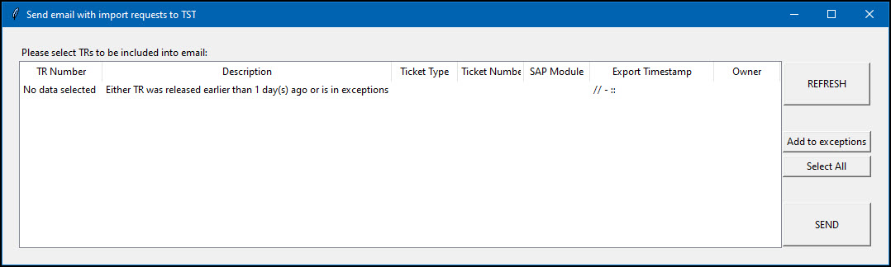
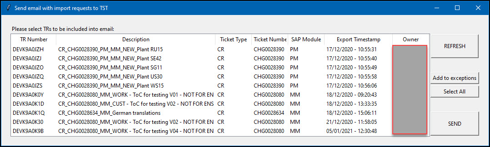

# Send email with released SAP transport reqeusts

This is my personal tool I'm using to generate and send an email to the team responsible for transport management across our SAP systems. This program doesn't have the best apperance and styling as it's purely for practical usage 😉

Functionality of the program:
  1. Fetches data of released Transport requests from SAP development system via custome made RFC enabled Function Module "Z_GET_RELEASED_TRANSPORTS" 
  2. parses data into desired format for displaying withing GUI
  3. Posibility to add one or more lines into exceptions
  4. Posibility to send email with one or more selected lines
  5. Once TR(s) are sent via email, they are added to exceptions

